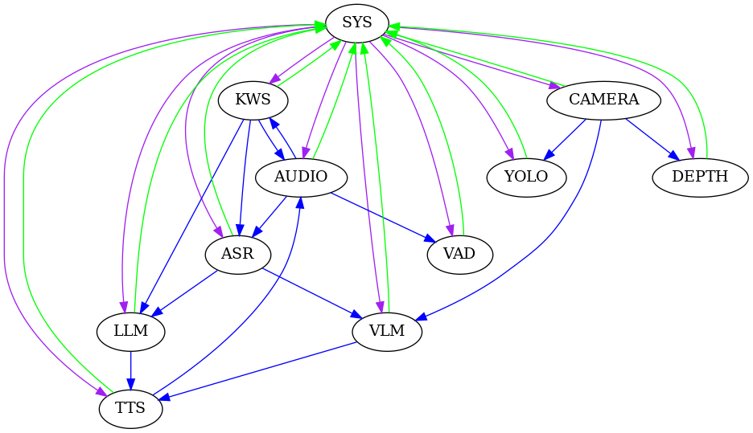

# StackFlow

<p align="center"></p>

<p align="center">
  StackFlow is a simple, fast, and elegant one-stop AI service infrastructure project aimed at embedded developers. Its purpose is to enable Makers and Hackers to quickly obtain powerful AI acceleration capabilities in current embedded devices. StackFlow can infuse a wise soul into various human-machine interaction devices.
</p>


## Table of Contents

* [Features](#Features)
* [Demo](#demo)
* [SystemRequirements](#SystemRequirements)
* [Compile](#Compile)
* [Installation](#Installation)
* [Upgrade](#Upgrade)
* [Run](#Run)
* [Configuration](#Configuration)
* [Interface](#Interface)
* [Contribution](#Contribution)


## Features
<!--  -->
* Distributed communication architecture. Each unit can operate independently or collaborate with other units.
* Support for multiple models, including but not limited to speech recognition, speech synthesis, image recognition, natural language processing, and LLM large model assistant inference, etc.
* Internal data flow. Different units can be configured to work together as needed, avoiding complex data processing workflows.
* Simple and easy to use. Exchange data through standard JSON to quickly implement AI services.
* Offline operation. Local AI services can be implemented without the need for an internet connection.
* Multi-platform support, including but not limited to Module LLM, LLM630 Compute Kit, etc.
* Flexible configuration. All units can be fully configured with operational parameters, allowing for model swapping and modification of model parameters within the same data flow processing scenario.
* Simple and easy to use. Developers only need to focus on the model and hardware platform without worrying about the underlying communication and data processing details, enabling quick implementation of AI services.
* Efficient and stable. Data transmission via ZMQ channels ensures high efficiency, low latency, and strong stability.
* Open source and free. StackFlow is licensed under the MIT License.
* Multilingual support. The core unit is implemented in C++ with extreme performance optimization and can be extended to support multiple programming languages. (Requires support for ZMQ programming)

StackFlow is continuously being optimized and iterated. While the framework becomes more comprehensive, more features will be added. Stay tuned.

Main working modes of the StackFlow voice assistant:

After startup, KWS, ASR, LLM, TTS, and AUDIO are configured to work collaboratively. When KWS detects a keyword in the audio obtained from the AUDIO unit, it sends a wake-up signal. At this point, ASR starts working, recognizing the audio data from AUDIO and publishing the results to its output channel. Once LLM receives the text data converted by ASR, it begins reasoning and publishes the results to its output channel. TTS, upon receiving the results from LLM, starts voice synthesis and plays the synthesized audio data according to the configuration.


## Demo
- [StackFlow continuous speech recognition](./projects/llm_framework/README.md)
- [StackFlow LLM large model awakening dialogue](./projects/llm_framework/README.md)
- [StackFlow TTS voice synthesis playback](./projects/llm_framework/README.md)
- [StackFlow yolo visual detection](https://github.com/Abandon-ht/ModuleLLM_Development_Guide/tree/dev/ESP32/cpp)
- [StackFlow VLM image description](https://github.com/Abandon-ht/ModuleLLM_Development_Guide/tree/dev/ESP32/cpp)

## SystemRequirements ##
The current AI units of StackFlow are built on the AXERA acceleration platform, with the main chip platforms being ax630c and ax650n. The system requirement is Ubuntu.

## Compile ##
StackFlow mainly operates on embedded Linux devices. Generally, please perform compilation work on the host Linux device. The compilation toolchain is aarch64-none-linux-gnu.
```bash
# Install X86 cross-compilation toolchain
wget https://m5stack.oss-cn-shenzhen.aliyuncs.com/resource/linux/llm/gcc-arm-10.3-2021.07-x86_64-aarch64-none-linux-gnu.tar.gz
sudo tar zxvf gcc-arm-10.3-2021.07-x86_64-aarch64-none-linux-gnu.tar.gz -C /opt

# Install dependencies
sudo apt install python3 python3-pip libffi-dev
pip3 install parse scons requests kconfiglib

# Download StackFlow source code
git clone https://github.com/m5stack/StackFlow.git
cd StackFlow
git submodule update --init
cd projects/llm_framework
scons distclean

# Compile. Note: When compiling, you need to be connected to the internet to download source code, binary libraries, and other files. Please ensure a stable network connection.
scons -j22

# Package the deb file. Note: Due to the large size of LLM model files, packaging the deb file requires a considerable amount of disk space. It is recommended to use disk space of 128GB or more. During packaging, a large number of binary files will be downloaded, so please be aware of data usage.
cd tools
python3 llm_pack.py
```

## Installation ##
The program and model data of StackFlow are separate. After the program installation is complete, you need to download the model data separately and configure it into the program. The installation involves first installing the program package, and then installing the model package. 

Bare-metal environment installation (execute the following commands on the LLM device):
```bash
# First, install the dynamic library dependencies.
dpkg -i ./lib-llm_1.4-m5stack1_arm64.deb
# Then, install the llm-sys main unit.
dpkg -i ./llm-sys_1.4-m5stack1_arm64.deb
# Install other llm units.
dpkg -i ./llm-xxx_1.4-m5stack1_arm64.deb
# Install the model package.
dpkg -i ./llm-xxx_1.4-m5stack1_arm64.deb
# Note the installation order of lib-llm_1.4-m5stack1_arm64.deb and llm-sys_1.4-m5stack1_arm64.deb. The installation order of other llm units and model packages is not required.
```

## Upgrade
When upgrading, you can either upgrade the AI unit individually or upgrade the entire StackFlow framework.  
When upgrading a single unit, you can upgrade via an SD card or manually install using the `dpkg` command. It's important to note that for minor version packages, you can install the upgrade package individually, but for major version upgrades, all llm units must be installed completely.  
Command line upgrade package:
```bash
# Install the llm units that need upgrading.
dpkg -i ./llm-xxx_1.4-m5stack1_arm64.deb
```
[Device automatic upgrade installation.](https://docs.m5stack.com/en/guide/llm/llm/image)
## Run ##
Relevant AI services will automatically run at startup and can also be manually started via command.  
Check the running status of the sys unit:
```bash
systemctl status llm-sys
```
You can refer to the systemd service commands for relevant commands.

## Configuration ##
StackFlow's configuration is divided into two categories: unit operation parameter configuration and model operation parameter configuration.  
Both types of configuration files use the JSON format and are located in multiple directories. The directories are as follows:
```
/opt/m5stack/data/models/
/opt/m5stack/share/
```
## Interface ##
StackFlow can be accessed via UART and TCP ports. The default baud rate for the UART port is 115200, and the default port for the TCP port is 10001. Parameters can be modified through configuration files.

## Contribution

* If you like this project, please give it a star first;
* To report a bug, please go to the [issue page](https://github.com/m5stack/StackFlow/issues);
* If you want to contribute code, feel free to fork it and then submit a pull request;

## Star History

[](https://star-history.com/#m5stack/StackFlow&Date)
